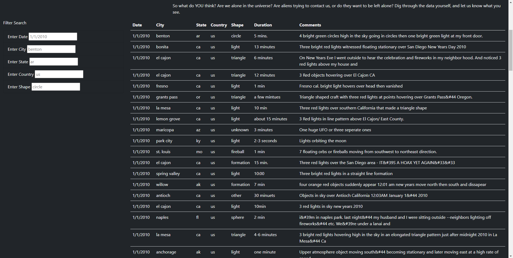
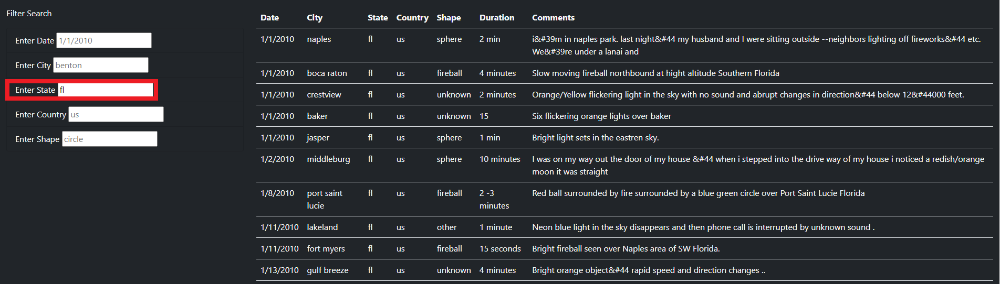

# UFO Finder Analysis

## Overview

The purpose of the following analysis was to provide a easy tool to use to look for and filter the data of UFO sightings available to us, collected in our [data.js](js/data.js). A user-friendly web application that is accessible to every hobbyist and enthusiast alike.

## Results

The web application is very simple and user-friendly. It may be utilized by any type of user to look up the information they are looking for. When first coming across our tool, users will be presented with the default table.



Then all they have to do is input their filter on the left-hand side of the page and press ```Enter```. After which, the table will be updated with their requested filter.



## Summary

This tool is very easy and fun to use. However, it does have room for improvement. The main drawback that the presented application has is the *lack of up-to-date data*. As recommendations for further development, we may wish to **link the data that is provided to the table** to a proper searchable and updatable database, so that when users use the filter search, they are presented with the most up-to-date data on their favorite UFO sightings. Another improvement would be to **allow users to upload their own stories** so they might be added to the existing data that the application uses.
